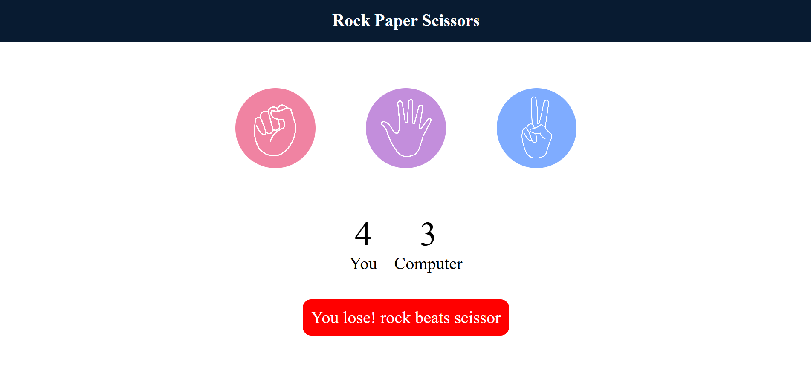

# ✊✋✌️ Rock Paper Scissors Game

A simple **Rock Paper Scissors** game built with **HTML, CSS, and JavaScript**.  
Play against the computer and see if you can win! 🎮  

---

## 🚀 Live Demo  
👉 [Click here to play] (https://rock-paper-scissor-pafo.onrender.com)   

---

## 📌 Features
- 🎨 Clean and responsive design  
- 🖱️ User can choose Rock, Paper, or Scissors  
- 🤖 Computer makes a random choice  
- ✅ Displays winner after each round  
- 🏆 Scoreboard to track User vs Computer  
- 🔄 Real-time messages for results  

---

## 🛠️ Tech Stack
- **HTML5** – Structure  
- **CSS3** – Styling  
- **JavaScript (Vanilla JS)** – Game logic  

---

## 📷 Screenshot
  
---

## 📂 Project Structure
Rock-Paper-Scissors/
│── index.html # Main HTML page
│── style.css # Styling
│── script.js # Game logic
│── images/ # Game images (rock, paper, scissor)
│── README.md # Documentation


---

## ⚡ How to Play
1. Open the game in your browser (or use the live demo link).  
2. Click on **Rock, Paper, or Scissors**.  
3. Computer makes its move automatically.  
4. Result is displayed with updated scores.  
5. First to get the higher score wins! 🎉  

---

## 📥 Installation (Run Locally)
1. Clone the repo:
   ```bash
   git clone https://github.com/akashh-21/Rock-Paper-Scissor.git
Open the folder:

cd rock-paper-scissors
Run the project:

Simply open index.html in your browser.

👨‍💻 Author
Kanuganti Aakash – (https://github.com/akashh-21)

